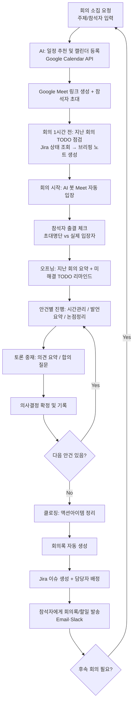
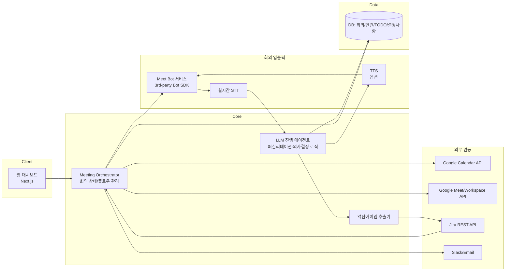
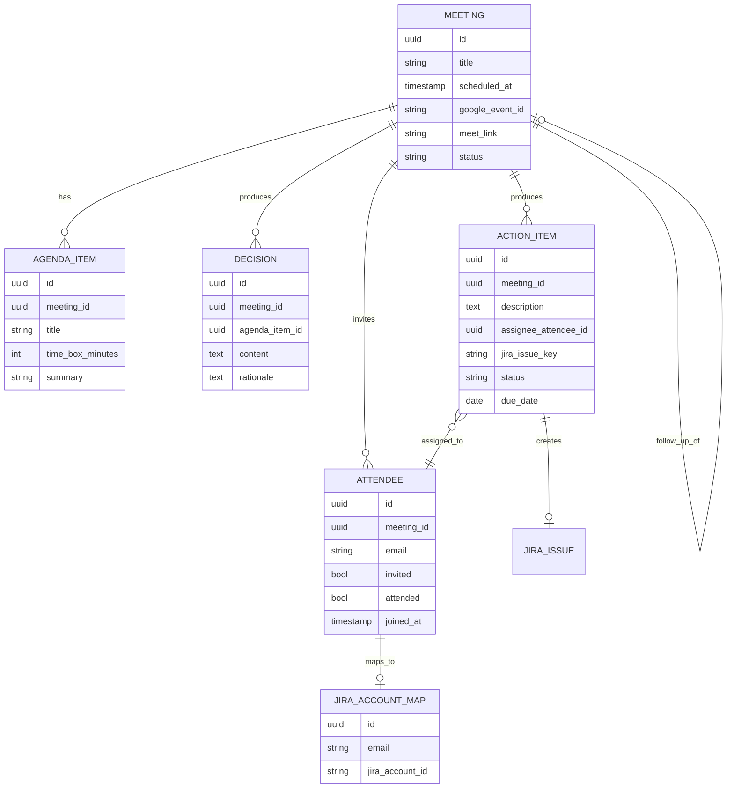

# AI 회의 진행 에이전트(MeetingOps AI) 개발 기획안

> 본 문서는 "AI가 팀장처럼 회의를 소집·진행·정리·후속관리까지 수행하는 에이전트"를 신규로 개발하기 위한 기획안입니다. 본 저장소(bloomcard, 멤버십 카드 서비스)와는 별도의 신규 프로젝트로, 인프라(Next.js + Supabase) 재사용 가능성만 일부 검토합니다.

## 1. 배경 및 문제 정의

| 현재(AS-IS) 문제 | 영향 |
|---|---|
| 회의 소집/캘린더 등록을 사람이 수동으로 함 | 일정 조율 비용, 누락 발생 |
| 지난 회의 액션아이템(TODO)이 다음 회의 전 점검되지 않음 | 의사결정 추적 실패, 동일 안건 반복 |
| 회의 중 진행/시간관리/논점 정리를 맡을 사람이 필요 | 진행자 부재 시 회의 비효율 |
| 회의록 작성, 담당자 배정(지라 이슈화)이 회의 후 수작업 | 실행 지연, 책임 소재 불명확 |

**목표**: 위 전 과정(소집 → 사전 점검 → 진행 → 의사결정 → 후속 업무 배정)을 AI 에이전트가 "팀장"의 역할로 자동 수행.

## 2. 프로젝트 목표

1. **회의 소집**: 주제/참석자만 입력하면 AI가 적정 일정을 잡아 Google Calendar 일정 + Google Meet 링크를 생성하고 초대.
2. **사전 점검**: 회의 시작 전 지난 회의의 TODO/액션아이템 진행 상태를 자동 점검해 브리핑 자료 생성.
3. **참석 확인**: 캘린더 초대 명단과 실제 Meet 참석자를 대조해 출결 체크.
4. **회의 진행**: 안건별 시간관리, 발언 요약, 토론 중재, 의사결정 도출까지 팀장 역할 수행.
5. **후속 관리**: 회의록 자동 작성, 액션아이템 추출 후 **Jira 이슈 생성 및 담당자(assignee) 배정**.

## 3. 핵심 기능 요약

| # | 기능 | 설명 |
|---|---|---|
| F1 | 회의 소집/캘린더 등록 | 자연어 지시("다음 주 스프린트 리뷰 잡아줘")로 일정·Meet 링크 생성, 참석자 초대 메일 발송 |
| F2 | 참석자 검증 | 초대자 명단 vs 실제 입장자 비교, 지각/결석 기록 |
| F3 | 지난 회의 TODO 점검 | 이전 회의록의 액션아이템을 Jira 상태와 대조해 완료/지연 여부를 브리핑 |
| F4 | 안건 진행(퍼실리테이션) | 안건별 타임박스 관리, 발언 정리, 논점 요약, "다음 안건으로" 전환 안내 |
| F5 | 토론 중재 및 의사결정 지원 | 찬반 의견 요약, 합의 여부 확인 질문, 결정사항 확정 및 기록 |
| F6 | 회의록 자동 생성 | 전사(transcript) 기반 요약, 결정사항/액션아이템 구조화 |
| F7 | 담당자 배정(Jira 연동) | 액션아이템 → Jira 이슈 생성, 발언자/문맥 기반 담당자(assignee) 자동 매핑 |
| F8 | 다음 회의 예약 제안 | 후속 회의가 필요한 안건 자동 식별 후 일정 제안 |

## 4. 전체 프로세스 흐름

## 5. AI 에이전트의 "팀장" 역할 설계

회의 중 에이전트가 수행하는 발화/행동을 단계별 페르소나 규칙으로 정의합니다.

| 단계 | 팀장 역할 행동 | 예시 발화(텍스트/TTS) |
|---|---|---|
| 오프닝 | 지난 회의 요약, 미해결 TODO 호명 | "지난 회의에서 결정된 A 항목 중 2건이 아직 Jira에서 In Progress입니다. 먼저 짧게 점검할까요?" |
| 안건 도입 | 안건과 목표, 예상 소요시간 공지 | "오늘 안건은 3개, 각 15분씩 진행하겠습니다. 첫 안건은 ○○입니다." |
| 진행 중 | 발언 누락자 호명, 시간 경고 | "○○님 의견 아직 안 들었는데 어떻게 생각하세요?" / "이 안건 시간이 5분 남았습니다." |
| 토론 중재 | 찬반 정리, 합의 유도 질문 | "지금까지 A안 2명, B안 1명 의견이 나왔는데, B안에 대한 우려가 있다면 말씀해주세요." |
| 의사결정 | 결정 확정 멘트 + 기록 | "그러면 A안으로 결정하겠습니다. 기록하겠습니다." |
| 클로징 | 액션아이템 재확인, 담당자 확인 | "오늘 액션아이템은 3건입니다. ○○님은 API 연동, △△님은 QA를 맡아주시면 Jira에 등록하겠습니다." |

**설계 원칙**
- 결정은 에이전트가 임의로 내리지 않고, **참석자 발언에서 합의/다수 의견을 감지해 "확인 질문"으로 확정**한다 (AI가 독단적으로 결론을 내리지 않도록 함).
- 모든 발화는 회의록에 타임스탬프와 함께 근거 발언을 함께 남겨 추적 가능하게 한다.
- 음성 발화(TTS) 여부는 1차로 텍스트(채팅) 진행으로 시작하고, 이후 단계에서 음성으로 확장(7장 로드맵 참조).

## 6. 시스템 아키텍처

### 컴포넌트 설명

| 컴포넌트 | 역할 | 비고 |
|---|---|---|
| Meeting Orchestrator | 회의 생성→진행→종료 전체 상태머신 관리 | 신규 백엔드 서비스(Node.js/Python) |
| LLM 진행 에이전트 | 발언 요약, 안건 전환, 토론 중재, 의사결정 확정 로직 | Claude 등 LLM + 도구 호출(Tool use) 구조 |
| Meet Bot 서비스 | Google Meet에 실제 "참가자"로 입장 | **자체 구현 대신 3rd-party Bot SDK 권장** (7장 참조) |
| 실시간 STT | 회의 음성을 텍스트로 변환 | Bot SDK 제공 스트림 또는 별도 STT 연동 |
| 액션아이템 추출기 | 회의록/전사에서 결정사항·할일·담당자 후보 추출 | LLM 기반 구조화 출력(JSON) |
| DB | 회의/참석자/안건/TODO/결정사항 영속화 | Supabase(Postgres) 재사용 가능 |
| 웹 대시보드 | 회의 예약, 회의록 열람, TODO/Jira 매핑 관리 UI | Next.js로 신규 구축, 기존 인프라 패턴 재사용 가능 |

## 7. 핵심 기술 이슈 및 해결 방안

### 7.1 Google Meet에 AI가 "참가자"로 자동 입장하는 문제 (가장 큰 기술 리스크)

- Google은 **제3자 봇이 일반 참가자처럼 입장해 음성/영상을 주고받는 것을 공식 지원하는 API를 제공하지 않습니다.** Google Workspace의 Meet REST API/Calendar API는 회의 생성, 회의록(conference record), 참석자 목록, (워크스페이스 관리자가 녹화/전사를 켠 경우) 녹취/전사 결과 조회 등은 제공하지만, "에이전트가 실시간으로 발언하는 참가자"는 공식 API 범위 밖입니다.
- **권장 방안**: Recall.ai, MeetingBaaS, Vexa.ai 등 "회의 봇 SDK"를 이용해 헤드리스 브라우저 기반으로 Meet에 게스트로 입장시키고, 실시간 오디오 스트림(STT 입력)과 가상 마이크 출력(TTS 출력)을 API로 받는 구조를 1차로 채택합니다. 자체 Puppeteer/Playwright 구현은 Google 약관·탐지 리스크가 있어 MVP 이후에도 권장하지 않습니다.
- **대안(저리스크 시작점)**: 1단계에서는 에이전트가 음성으로 "말하지 않고", 회의 중 **Google Meet 채팅창에 텍스트로 진행 멘트를 올리는 방식**으로 시작해 리스크를 낮추고, 검증 후 음성(TTS) 참여로 확장합니다.

### 7.2 실시간 한국어 STT 정확도

- 회의 중 기술 용어/사람 이름 인식 오류 가능성 → 참석자 명단/프로젝트 용어집을 STT 커스텀 vocabulary로 사전 등록.
- 후보 엔진: Google STT(한국어), Whisper, Deepgram (실시간 스트리밍 + 한국어 지원 비교 필요).

### 7.3 참석자 ↔ Jira 계정 매핑

- 회의 참석자는 이메일 기준으로 식별되므로, **Jira 계정과 이메일을 1:1로 매핑하는 테이블**을 미리 구축(조직 멤버 온보딩 시 등록).
- 매핑이 없는 참석자에게 액션아이템이 배정되면 자동 배정을 보류하고 담당자 확인을 요청.

### 7.4 의사결정의 신뢰성

- AI가 "결정했다"고 잘못 기록하지 않도록, 결정 확정 직전에 반드시 **"~로 결정하겠습니다, 맞을까요?" 확인 발화 → 명시적 동의/침묵 타임아웃 규칙**을 거치도록 설계.

## 8. 외부 연동 명세

| 연동 대상 | 용도 | 인증 방식 | 비고 |
|---|---|---|---|
| Google Calendar API | 일정 생성/수정, 참석자 초대 | OAuth 2.0 (조직 도메인 위임 또는 사용자 동의) | Google Meet 링크는 Calendar 이벤트 생성 시 conferenceData로 함께 생성 |
| Google Meet REST API | 참석자 목록, 회의 종료 후 conference record/전사 조회(워크스페이스 설정 필요) | OAuth 2.0 / 서비스 계정 | 실시간 음성 참여는 미지원 → 7.1 참조 |
| Meet Bot SDK (3rd-party) | 실시간 음성 입장/STT 스트림/TTS 출력 | 벤더별 API Key | 벤더 선정 필요(보안/비용 검토) |
| Jira REST API v3 | 이슈 생성, assignee 배정, 상태 조회(지난 TODO 점검용) | OAuth 2.0 (3LO) 또는 API Token | Jira Cloud 기준 |
| Slack / Email | 회의록·액션아이템 발송, 회의 리마인드 | Slack OAuth / SMTP | 기존 알림 채널 재사용 |

## 9. 데이터 모델 (핵심 테이블)

## 10. 보안 및 개인정보 보호

- **녹음/전사 동의**: 회의 시작 시 참석자에게 AI 녹음/전사 사실을 명시적으로 고지(법적 요건 검토 필요, 한국은 통신비밀보호법상 통화·대화 녹음 동의 이슈 확인).
- **데이터 보존 정책**: 전사/녹음 원본 보관 기간 정의 및 자동 삭제.
- **접근 제어**: 회의록·결정사항 조회는 해당 회의 참석자 및 권한자만 가능하도록 RLS(Row Level Security) 적용(Supabase 활용 시 기존 패턴 재사용).
- **OAuth 스코프 최소화**: Calendar/Jira 연동 시 필요한 최소 스코프만 요청.

## 11. 리스크 및 제약사항

| 리스크 | 설명 | 대응 |
|---|---|---|
| Meet 실시간 참여 기술 리스크 | 7.1 참조, 공식 API 부재 | 3rd-party Bot SDK 채택 + 텍스트 진행으로 단계적 시작 |
| STT/요약 오류로 인한 잘못된 의사결정 기록 | AI의 오해로 결정사항이 왜곡될 가능성 | 결정 확정 전 사람 확인 절차 필수화(7.4) |
| Jira 담당자 자동배정 오류 | 발언 맥락 오판으로 잘못된 담당자 지정 | 자동배정 후 "확인" 단계 추가, 모호한 경우 보류 |
| 녹음/AI 참여에 대한 참석자 거부감·법적 이슈 | 회의 분위기, 법적 동의 문제 | 사전 동의 절차 의무화, 옵트아웃 가능하게 설계 |
| 벤더 종속성(Bot SDK) | 특정 벤더 장애/정책 변경 시 핵심 기능 중단 | 벤더 인터페이스 추상화(어댑터 패턴)로 교체 가능하게 설계 |

## 12. 단계별 로드맵

| 단계 | 목표 | 주요 산출물 | 기간(예상) |
|---|---|---|---|
| Phase 1 | 회의 소집/캘린더 자동화 + 지난 TODO 점검(MVP, 사람이 직접 진행) | Calendar/Meet 연동, 회의 전 브리핑 노트 생성, 대시보드 | 4주 |
| Phase 2 | 회의 후 자동화 | 전사(수동 업로드 또는 워크스페이스 전사) 기반 회의록 자동 생성, 액션아이템 추출, Jira 이슈 생성 | 4주 |
| Phase 3 | 실시간 텍스트 진행 에이전트 | Bot SDK로 Meet 입장, 채팅 기반 진행(시간관리/안건전환/리마인드), 실시간 참석 체크 | 6주 |
| Phase 4 | 음성 기반 퍼실리테이션 + 의사결정 지원 고도화 | TTS 음성 발화, 토론 중재 로직, 결정 확정 플로우, 담당자 자동배정 확인 절차 | 6~8주 |

## 13. 성공 지표(KPI)

- 회의 소집~일정 확정까지 소요 시간 감소율
- 회의록/액션아이템 작성에 드는 수작업 시간 감소율
- 지난 회의 TODO 완료율 추적 정확도(자동 점검 vs 실제 Jira 상태 일치율)
- Jira 이슈 자동 생성 후 담당자 정정 비율(낮을수록 좋음)
- 참석자 만족도(회의 진행 품질 설문)

## 14. 추후 확정 필요 사항 (Open Questions)

1. Meet Bot SDK 벤더 선정 기준(보안 심사, 비용, 한국어 지원 수준) — 누가 검토/승인하는지.
2. 회의 녹음·AI 참여에 대한 사내 정책 및 참석자 동의 절차(법무 검토 필요 여부).
3. Jira Cloud/Server 여부 및 조직의 Jira 프로젝트/이슈 타입 컨벤션.
4. 1단계부터 음성 발화를 포함할지, 텍스트 진행으로 먼저 검증할지.
5. 본 시스템을 별도 신규 저장소로 분리할지, 기존 인프라(Supabase 등) 내 신규 서비스로 통합할지.
